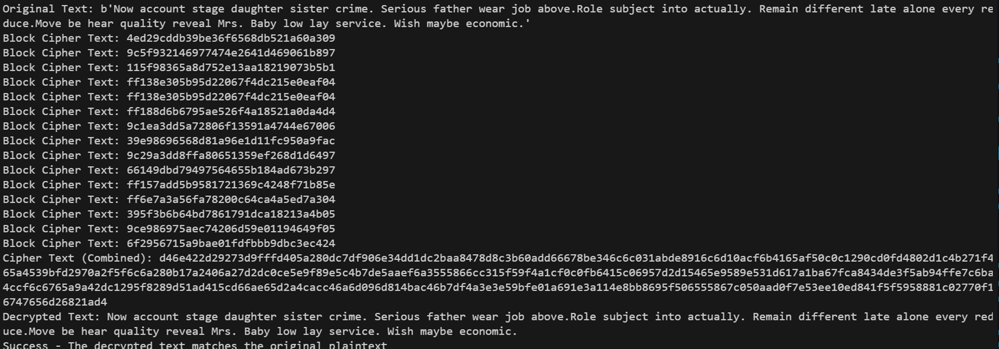
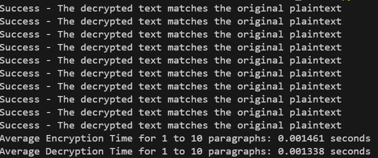

# CS-445-Model
This is a model created for CS 445. This model combines features from both ChaCha20 and Serpent.

## Requirements
- Python
- The `Faker` library for plaintext generation. You can install it via:

```
pip install faker
```

## Usage
1. CD into New_Model folder
2. Prepare the plaintext.txt file with the text u want to encrypt/decrypt
3. Execute the script with:
```
python model2.py
```
3. Analyze outputs
- ciphertext_combined.txt: Contains the encrypted data
- decrypted_combined.txt: Contains the decrypted plaintext
- The Console also provides block cipher text for each block and the final cipher text once stream cipher is done 

## Model details
This model combines simplified features from both ChaCha20 and Serpent.
Below is the paramaters for each component of ChaCha20 and serpent in the model.

| Parameter                          | Description                                           |
|------------------------------------|-------------------------------------------------------|
| **Block Cipher Key Size**          | 128 bits (16 bytes)                                  |
| **Stream Cipher Key Size**         | 32 bits (4 bytes)                                   |
| **Block Size**                     | 16 bytes (128 bits)                                 |
| **Rounds in Block Cipher**         | 16 rounds                                           |


## Components
| Component                  | Description                                                                       |
|----------------------------|-----------------------------------------------------------------------------------|
| **Input Layer**            | Reads plaintext input from a file                                                |
| **Key Generation**         | Generates round keys for the block cipher using a simple key schedule            |
| **S-box Substitution**     | Substitutes block values using a simple S-box operation                         |
| **Rotation Functions**      | Rotates bits left (for encryption) and right (for decryption) in each round      |
| **Block Encryption**        | Encrypts 16-byte blocks using the block cipher with multiple rounds              |
| **Block Decryption**        | Decrypts 16-byte blocks using the same round keys in reverse order               |
| **Stream Cipher**          | Encrypts/decrypts data using XOR with a stream key                               |
| **Combined Encryption**     | Encrypts plaintext using the block cipher followed by the stream cipher           |
| **Combined Decryption**     | Decrypts using the stream cipher first, followed by the block cipher             |
| **Verification**           | Compares the original plaintext with the decrypted text to ensure correctness     |

## Results
We were able to successuly encrypt and decrypt data utlizing both the stream and block cipher.
Below is an image of an example output:


We also tested the times. Below is an example of this testing. It resulted in ~9 percentage difference between encryption and decryption. 

